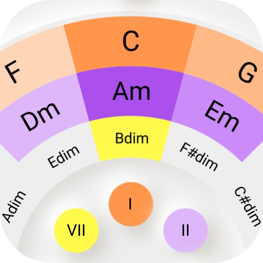

* **Circle of 5ths**

  
  

  [Privacy policy](/circle_of_5ths_privacy_policy/)

* **SQLite3 Wrapper C++ Library**

  <!-- Place this tag where you want the button to render. -->
  <a class="github-button" href="https://github.com/herolover/sqlite3_wrapper/subscription" data-size="large" data-show-count="true" aria-label="Watch herolover/sqlite3_wrapper on GitHub">Watch</a>

  <!-- Place this tag in your head or just before your close body tag. -->
  
